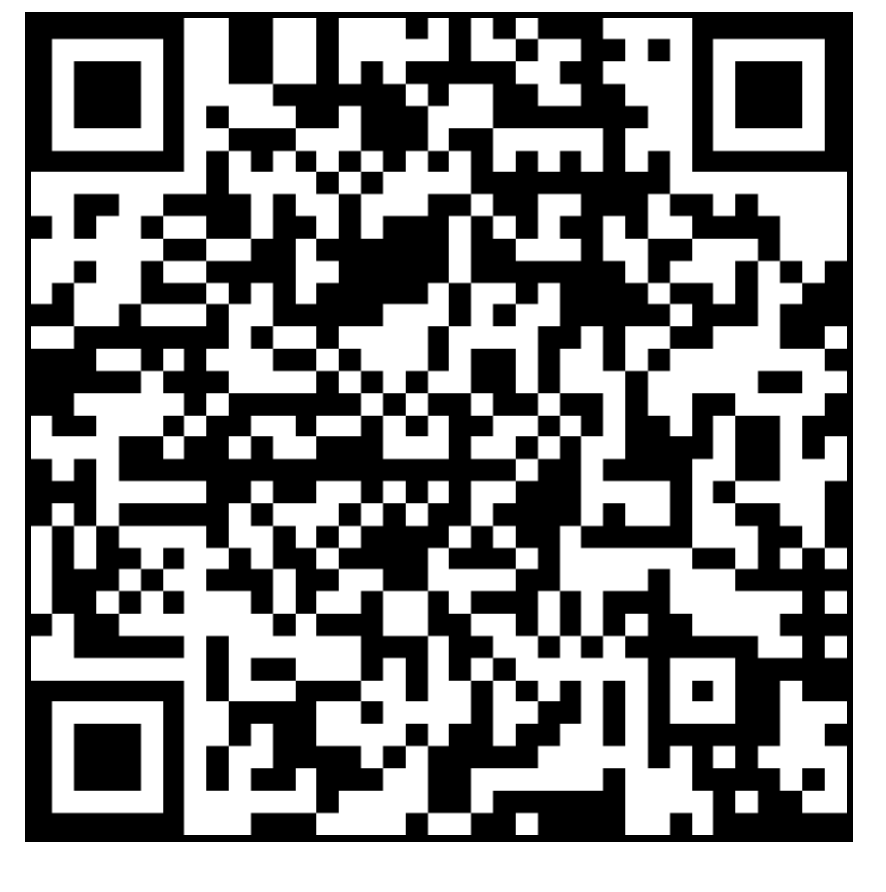

# [J Cal](github.com/LafeLabs/jcal)

Calibration of radio frequency circuits using Josephson Junctions.

$$
Z_{in} = \frac{1}{i 2\pi f C}
$$

 - [index.html](index.html)
 - [branch.html](branch.html)
 - [qrcode.html](qrcode.html)
 - [geometron-icon-factory/](geometron-icon-factory/)